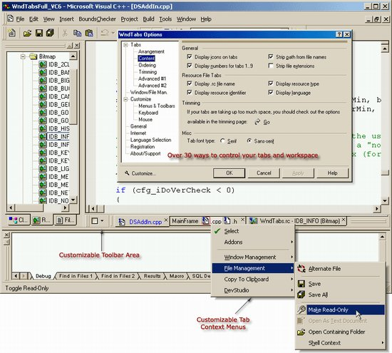

# The Chinese(Simplified) Localization Resources for WndTabs

[WndTabs] is a cool productivity add-in for Visual C++ 6, extend VC6 by multi-tabbed user experiences. [WndTabs] and [Visual Assist] are the two most favorite addins for me when writing codes using VC6, I can't live without them in early period of my develop life. :smile:

[WndTabs] is develop by Oz Solomonovich, the generous guy opened source code of WndTabs under the MIT license. You could visit the website to get more information.

For the love of WndTabs, I create simplified Chinese language pack for WndTabs v3.10 with Oz's permitting in 2002. There is an article written by Oz described more details of the localization - https://www.codeproject.com/Articles/107/Window-Tabs-WndTabs-Add-In-for-DevStudio. Also, you could use these Chinese localized resources under the MIT license.

[WndTabs]: http://www.wndtabs.com/
[VISUAL ASSIST]: https://www.wholetomato.com/
